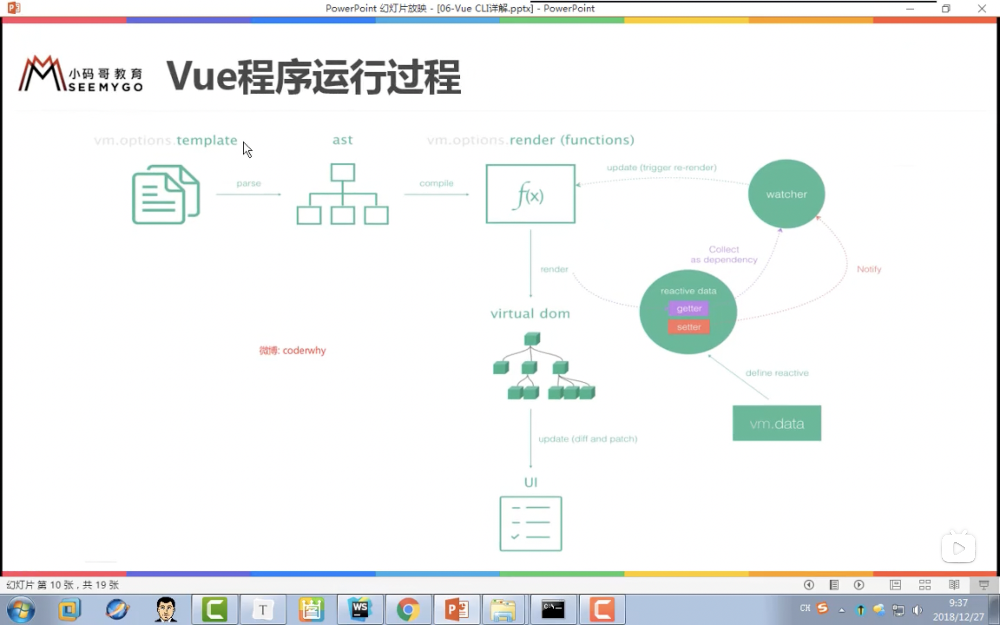

#### 兩個透過 Vue init 生成的資料夾最大的差別在於 main.js:
1. compiler直接透過template使用模板並註冊
2. only使用 render: h => h(App) 渲染
>  template - parse(解析) > ast(抽象語法樹) - compile(編譯) 
>    > rander(functions) > vdom(虛擬DOM) > 真實DOM
 

#### 結論
> compiler: template -> ast -> rander -> vdom -> UI
> only: rander -> vdom -> UI  (性能更高 / 程式碼更少)
 

回顧： https://www.bilibili.com/video/BV15741177Eh?p=96
 

